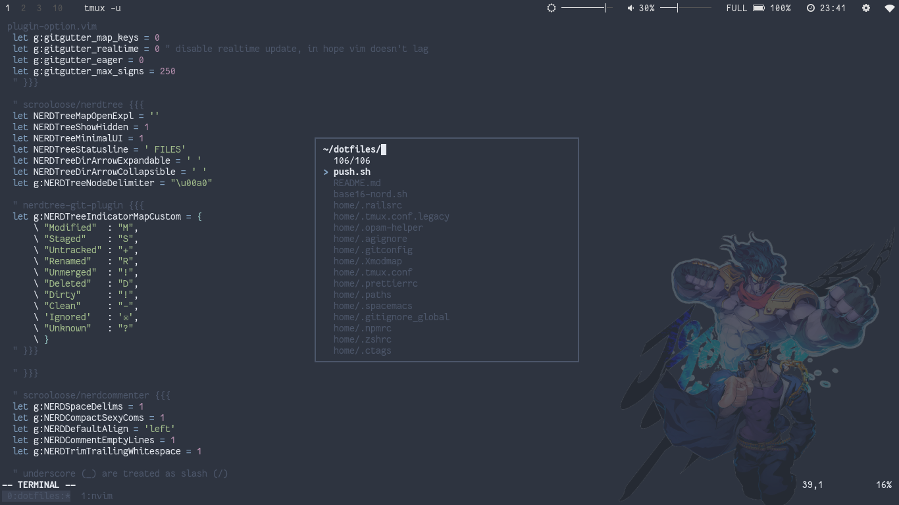
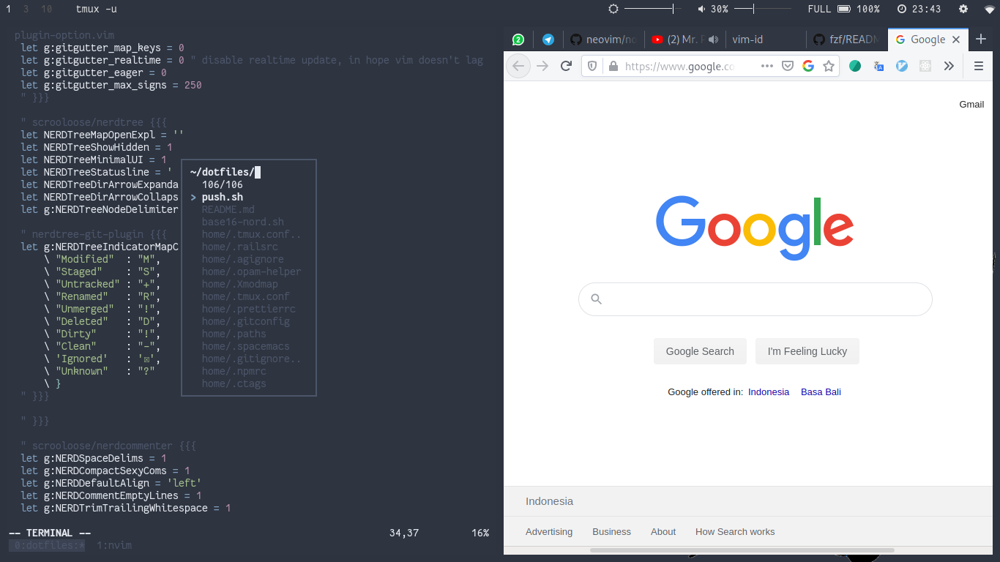
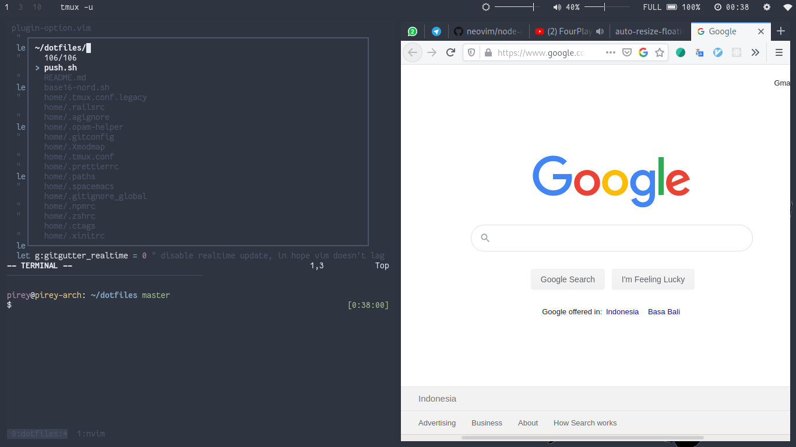

# Auto resize floating window FZF

[fzf](https://github.com/junegunn/fzf) mendukung fitur [popup window](https://vimhelp.org/popup.txt.html#popup-window) (vim) atau floating window (neovim). Fitur ini memungkinkan vim untuk menampilkan window yang _melayang_.

Berikut ini contoh tampilan fzf di neovim dengan fitur floating window, simpel dan manis:



Untuk menggunakan fitur floating window seperti di atas, perlu [konfigurasi](https://github.com/junegunn/fzf/blob/master/README-VIM.md#starting-fzf-in-a-popup-window) kurang lebih seperti ini:

```
let g:fzf_layout = { 'window': { 'width': 0.3, 'height': 0.5 } }
```

Maksud dari `'width': 0.3` adalah kita set lebar window sebesar `30%`. Begitu juga `'height': 0.5`, maksudnya kita set tinggi window sebesar `50%`.

## Kendala

Tampilan di atas cukup _ok_ jika kita window editor atau terminal yang kita buka cukup lebar.

Tapi, terkadang saya membuka editor bersamaan dengan browser, misalnya saat baca-baca tutorial atau melihat _live preview_, maka ukuran window fzf jadi terlalu sempit:



## Solusi

Untuk mengatasi kendala di atas, kita perlu mengatur ulang lebar dan tinggi window fzf saat ukuran terminal terlalu sempit.

Kita bisa memanfaatkan auto command ([:h autocmd](http://vimdoc.sourceforge.net/htmldoc/autocmd.html#:autocmd)) untuk mendeteksi perubahan ukuran editor.

```
autocmd VimResized * call NamaFunction()
```

Kode di atas maksudnya, vim akan memanggil function (`call NamaFunction`) tiap kali ukuran editor berubah ([VimResized](http://vimdoc.sourceforge.net/htmldoc/autocmd.html#VimResized)), misalnya resize ukuran terminal, resize pane di tmux, dll untuk semua tipe dokumen (`*`).

Untuk ini, kita bisa menulis function untuk menentukan tinggi dan lebar window, dan mengatur ulang konfigurasi fzf di dalam function tersebut.

```
function! FZFSetWinSize()
  " tentukan batas minimal baris dan kolom di terminal,
  " jika jumlah kolom / baris di terminal lebih sedikit dari nilai ini,
  " maka kita atur ulang ukuran window fzf
  let min_column = 100
  let min_line = 30

  let width_default = 0.5
  let height_default = 0.5

  " tinggi dan lebar window saat ukuran terminal terlalu kecil (90%)
  let width_full = 0.9
  let height_full = 0.9

  " &columns merupakan option vim yang berisi jumlah kolom di terminal saat ini
  " &lines berisi jumlah baris

  let width = &columns < min_column ? width_full : width_default
  let height = &lines < min_line ? height_full : height_default

  " atur ulang konfigurasi fzf
  let g:fzf_layout = { 'window': { 'width': width, 'height': height } }
endfunction
```

Setelah itu, kita sesuaikan penggunaan `autocmd` di atas, menjadi:

```
autocmd VimResized * call FZFSetWinSize()
```

Function di atas sudah ok, hanya saja, itu hanya akan dijalankan setelah kita mengubah ukuran terminal. Jadi, kalau dari awal kita sudah membuka vim dengan ukuran terminal yang kecil, ukuran fzf akan tetap mengikuti konfigurasi awal.

Kita juga perlu menjalankan function tersebut saat pertama kali membuka vim. Untuk itu, ada event auto command bernama [VimEnter](http://vimdoc.sourceforge.net/htmldoc/autocmd.html#VimEnter).

Karena function yang perlu dijalankan sama, kita cukup tambahkan saja seperti ini:

```
autocmd VimResized * call FZFSetWinSize()
autocmd VimEnter * call FZFSetWinSize()
```

Kita bisa tambahkan definisi function dan pemanggilan autocmd diatas ke dalam `.vimrc` kita.

Hasilnya:



Sebenarnya saya belum memeriksa apakah fzf menyediakan pilihan konfigurasi untuk masalah di atas, tapi ya sudahlah, sudah terlanjur teratasi masalahnya.

## Tips

Pemanggilan `autocmd ...` di atas sebenarnya berarti kita mendaftarkan _handler_ untuk masing-masing _event_ (`VimResized`, `VimEnter`, `BufEnter`, dll) pada vim.

Jika kita memuat ulang `.vimrc`, misalnya dengan `:source ~/.vimrc` atau semacamnya, pendaftaran _handler_ di atas akan terduplikasi, sehingga memakan _resource_ dan biasanya membuat vim menjadi lambat.

Supaya pendaftaran handler tidak berulang-ulang, kita bisa bungkus dengan [:h augroup](http://vimdoc.sourceforge.net/htmldoc/autocmd.html#:augroup):

```
" fzf_win_resize ini hanya nama untuk augroup buatan kita,
" bisa diganti nama apa saja
augroup fzf_win_resize

    " ini untuk menghapus semua autocmd di dalam group ini, lalu mendaftarkan lagi di bawah ini
    autocmd!

    autocmd VimResized * call FZFSetWinSize()
    autocmd VimEnter * call FZFSetWinSize()
augroup END
```
